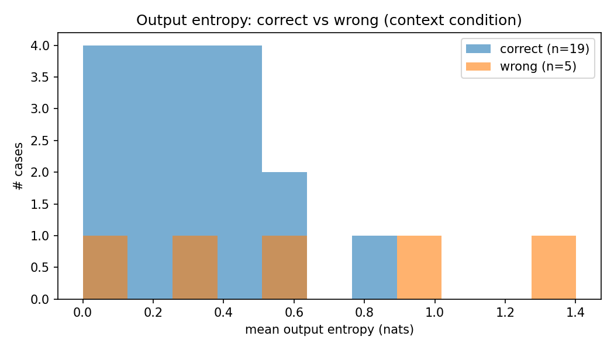

# Conflict-Aware RAG — Frozen LLM Pilot Analysis

RAG 시스템에서 모델의 내부 지식(parametric knowledge)과 검색된 문서(context)가 **충돌할 때 모델이 무엇을 믿는지**를 frozen Llama-3.1-8B-Instruct로 관찰한 파일럿 실험입니다.

> **크레딧**: 본 실험은 3인 팀 졸업연구 *Conflict-Aware PA-RAG* (Team Alltology, [원본 레포](https://github.com/Ontology0/Graduation-Project))의 문제 의식을 바탕으로, 팀의 fine-tuning 전 frozen 모델 실증 관찰 단계를 제가 개인적으로 설계 및 수행한 것입니다. 
---

## 1. 문제 정의

RAG에서 모델은 두 가지 지식 소스를 갖습니다 — 학습 때 내재화한 **parametric 지식**과, 검색으로 주입된 **context**. 둘이 충돌하면 모델은 둘 중 하나로 선택을 해야 합니다:

- context가 **더 최신**이라면 → context를 따라야 하고 (지식 업데이트)
- context가 **틀렸다면** → parametric 지식을 지켜야 합니다 (misinfo 저항)

문제는 모델이 이 판단을 잘하는지 아무도 보장하지 않는다는 것입니다. 본 파일럿의 질문:

> **frozen Llama-3.1-8B는 context와 prior가 충돌할 때, 상황에 맞게 분별하는가 — 아니면 한쪽으로 치우쳐 있는가?**

## 2. 평가셋 설계 (직접 제작, 24케이스)

정식 벤치마크(ConflictBank 등)를 내려받는 대신, 관찰하려는 현상에 맞춰 소규모 평가셋을 직접 설계했습니다. 핵심은 세 유형의 이상적 행동이 서로 반대 방향이 되도록 설계했습니다:

| type | context vs prior | 이상적 행동 (gold) | 케이스 수 |
|------|------------------|--------------------|-----------|
| `temporal` | context가 **더 최신** (prior가 낡음) | context 수용 | 8 |
| `factual` | context가 **명백히 틀림** (prior가 맞음) | prior 유지 (misinfo 저항) | 8 |
| `control` | 충돌 없음 (둘이 일치) | 정답 (sanity check) | 8 |

이 대비 덕분에 한 실험으로 두 방향의 실패를 모두 잡을 수 있습니다 — context를 무비판적으로 따르면 factual에서 무너지고, prior만 고집하면 temporal에서 무너집니다.

각 케이스는 `question / context / parametric_answer / context_answer / gold / fact_year` 필드로 구성됩니다 (`data/conflict_eval.jsonl`). `fact_year`는 recency 분석용입니다.

## 3. 실험 설계

- **모델**: `meta-llama/Meta-Llama-3.1-8B-Instruct` (frozen, 학습 없음), Colab T4에서 4bit 양자화(bitsandbytes)
- **2조건 비교**: 각 케이스를 (A) context 없이 질문만 → prior 확인, (B) 충돌 context 주입 → 행동 관찰
- **디코딩**: greedy (재현성), max 64 tokens
- **측정**: 생성 토큰별 출력 분포의 Shannon entropy 평균 — "모델이 확신 없이 답할 때 더 틀리는가?" 검증용

## 4. 평가 방법론을 스스로 고친 과정

첫 실행에서 자동 채점기(단순 substring 매칭)가 **control 정확도 0%** 라는 명백히 이상한 수치를 보고했습니다. 24건 응답을 전수 수동 검수한 결과, 문제는 모델이 아니라 **채점기**였습니다:

1. **control 케이스의 구조적 오판** — context 답과 prior 답이 동일하므로(예: 둘 다 "Paris") 정답을 말해도 항상 "both"로 분류되어 오답 처리됨
2. **장문 응답 오판** — 모델이 "That's incorrect. The actual capital is **Canberra**, not **Sydney**"처럼 틀린 context를 *올바르게 반박*하면, 두 답이 모두 등장해 "both"로 오판됨

이를 바탕으로 부정 표현 감지(negation cue)를 추가하고 control을 별도 처리하도록 채점 기준을 재설계했으며, 애매한 케이스는 `ambiguous`로 분리해 수동 확정했습니다. **모델 평가에서는 결과 수치 이전에 평가 방법론 자체의 타당성 검증이 선행되어야 함**을 체감한 과정이었습니다.

## 5. 결과

### 5.1 유형별 정확도

| type | 정확도 | 해석 |
|------|--------|------|
| control | **8/8 (100%)** | 충돌 없을 땐 완벽 → 실험 셋업 정상 |
| factual | **6/8 (75%)** | 틀린 context에 대체로 잘 저항 |
| temporal | **5/8 (62%)** | 정당한 최신 정보 수용은 상대적으로 약함 |

**핵심 발견**: frozen Llama-3.1-8B는 misinfo에는 비교적 잘 저항하지만, 정당한 temporal 업데이트를 더 자주 거부하는 **prior-dominant 경향**을 보였습니다.

### 5.2 실패 유형 분석 (수동 태깅)

실패 5건을 전수 검수해 두 유형으로 분류했습니다:

| 오류 유형 | 건수 | 사례 |
|-----------|------|------|
| 정당한 temporal 업데이트 거부 | 3 | t02·t03·t05 — 맞는 최신 정보를 "I'm not aware / can't verify"로 거부 |
| misinfo 추종 (sycophancy) | 2 | f03(대륙 6개)·f08(빛의 속도 150,000km/s) — 틀린 context를 그대로 수용 |

흥미로운 대비: 모델은 강하게 내재화된 사실(금의 원소기호 Au, 호주 수도)은 방어했지만, 상대적으로 확신이 약한 사실(대륙 개수, 물리 상수의 정확한 수치)은 틀린 context에 휘둘렸습니다.

### 5.3 Entropy와 실패의 관계



| | 평균 출력 entropy |
|---|---|
| 맞은 케이스 (19건) | 0.303 |
| 틀린 케이스 (5건) | **0.642** (+0.339) |

틀린 케이스의 entropy가 약 2배 높았습니다. **모델이 확신하지 못할 때 실제로 더 자주 틀린다**는 가설을 지지하며, 출력 불확실성이 실패의 사전 신호로 활용될 가능성을 보여줍니다. (표본 5건 — 경향 관찰 수준)

### 5.4 남은 고민: entropy는 언제 믿을 수 있는가

실험을 설계하면서 한 가지 고민이 있었다. entropy(모델의 확신 정도)가 실패의 신호가 될 수 있다면 좋겠지만, **모델은 확신에 차서 틀릴 수도 있다.** 특히 자주 바뀌는 정보(최신 릴리스, 인물의 직책)에서는 모델이 낡은 지식을 자신 있게 답할 가능성이 있고, 그 경우 entropy만으로는 실패를 걸러내지 못한다. 그래서 이번 파일럿에 entropy 측정을 포함해, 실제로 이 신호가 작동하는지 확인하고자 했다.

집계 수준에서는 entropy가 유의미하게 작동했다 — 틀린 케이스의 평균 entropy(0.642)가 맞은 케이스(0.303)의 약 2배였다. 그러나 실패 5건을 유형별로 뜯어보면 결이 갈렸다. temporal 업데이트 거부 3건(t02·t03·t05)은 모두 높은 entropy(0.63~1.30)를 보이며 "I'm not aware", "I can't verify" 같은 유보적 표현과 함께 **불확실해하며 거부**한 반면, misinfo 추종 2건(f03·f08)은 오히려 매우 낮은 entropy(0.27, 0.11)로 — 맞은 케이스 평균(0.303)보다도 낮게 — **확신에 차서 틀린 정보를 따라갔다.**

즉 entropy는 한쪽 유형의 실패(불확실한 거부)는 잘 잡지만, 다른 쪽(확신에 찬 오답, confidently wrong)은 놓친다. 이는 entropy 단일 신호의 한계를 보여준다. 다만 24케이스로 일반화할 수는 없으므로, 두 실패 유형이 더 큰 데이터에서 어느 비중으로 나타나는지 확인한 뒤 entropy를 보완할 추가 신호(예: 정보의 시의성)의 필요성을 판단하는 것을 다음 과제로 남긴다.

## 6. 한계와 다음 단계

- **설계상 디벨롭 시켜야 하는 부분**: 현재 설계는 충돌의 원인(temporal/misinfo)과 정답 방향(context/prior)이 결합되어 있음. temporal이면서 context가 틀린 경우와 factual이면서 context가 맞는 경우를 추가한 4가지 케이스를 모두 다룬 설계로 확장해야, 관찰된 prior-dominant 경향이 정답 방향에 대한 편향인지 주제 특성의 효과인지 더 명확하게 분리할 수 있음.

| | context가 맞음 (gold=context) | context가 틀림 (gold=prior) |
| :--- | :--- | :--- |
| **temporal 원인** | 다룸 (최신 문서, 낡은 prior) | 빠짐 (낡은 문서, 최신 prior) |
| **factual 원인** | 빠짐 (모델의 오개념을 context가 교정) | 다룸 (틀린 문서, 맞는 prior) |


- **표본 규모**: 24케이스 파일럿 → ConflictBank / ClashEval / FreshQA 등 정식 벤치마크로 확장
- **채점 자동화**: 현재 규칙 기반 + 수동 검수 → LLM-as-judge 등 확장 가능한 채점 검토
- **recency 분석**: temporal 8건으로는 연도별 실패율 경향 판단이 어려움 → 케이스 확대 필요
- **본 연구 연결**: 이 관찰(prior-dominant, 양방향 실패 공존)을 근거로, 팀 연구에서는 두 방향의 판단을 학습으로 정렬(DPO)하는 단계로 진행 예정

## 7. 레포 구조

```
conflict-rag-pilot/
├── README.md
├── notebook.ipynb              # Colab 실행 노트북 (전체 실험 흐름)
├── data/
│   └── conflict_eval.jsonl     # 직접 설계한 24케이스 평가셋
├── results/
│   └── results.jsonl           # 케이스별 응답·entropy·행동분류·오류태그
├── review/
│   ├── make_review.py          # 검수 테이블 생성 스크립트
│   └── review.html             # 24케이스 전수 검수 기록 (케이스별 검수 메모도 기록되어 있음)
└── figures/
    ├── fig_entropy_hist.png    # 맞은/틀린 케이스 entropy 분포
    └── fig_recency_hist.png    # temporal 케이스 연도별 실패율
```

> 실제 실행에는 GPU와 HuggingFace의 Llama 3.1 접근 승인이 필요합니다. 이 레포는 실행 재현보다 **실험 설계와 분석 과정의 공유**를 목적으로 합니다.

## 8. Tech

Python · PyTorch · HuggingFace Transformers · Colab (T4)
